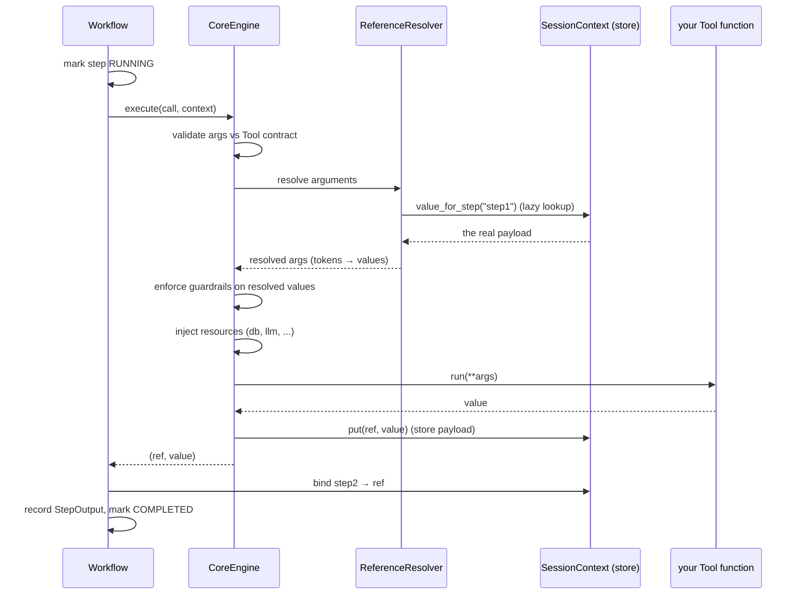
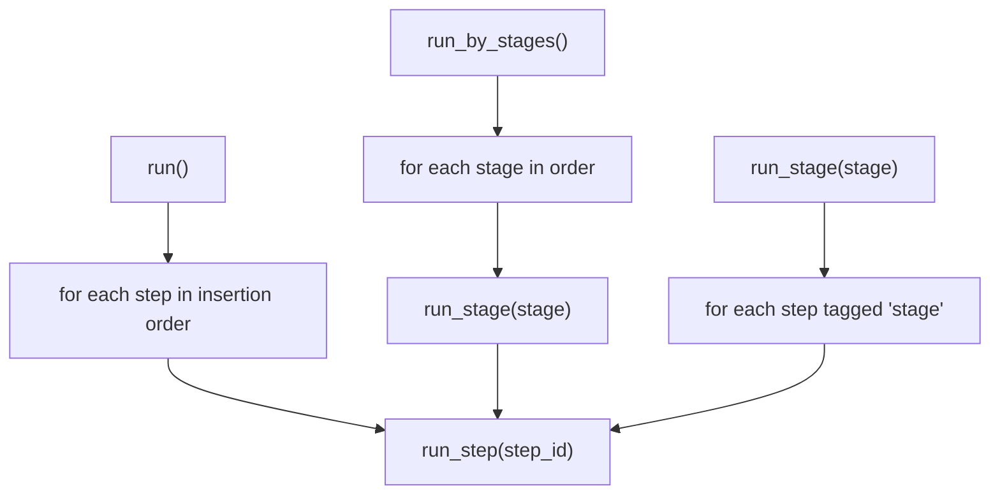
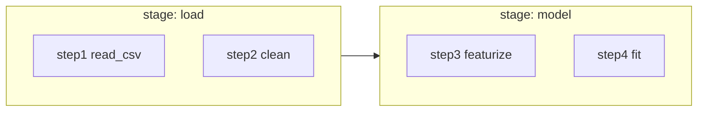

# Simple Steps — Execution Model (the "run" story)

This is the companion to [object-model.md](object-model.md). That doc is about
the **nouns** you hold and inspect. This one is about the **verb**: what happens
when you press *run*. The engine and its helpers are a **separate component** —
you rarely hold them directly; they power `Workflow.run(...)`.

> **Key correction to a common assumption:** the engine does **not** build or
> hold a reference graph / DAG. References (`"step1"`, `"step1.total"`) are
> resolved **lazily, per step, at the moment that step runs**, by looking the
> token up in the session's payload store. Execution order is simply the
> Workflow's **insertion order**. The DAG is *derivable* (scan the tokens) but
> nothing constructs it today.

---

## 1. The cast (engine-side objects — the separate component)

| Object | Role |
|---|---|
| `CoreEngine` | executes one `ToolCall`: validate → resolve → guardrail → inject resources → run → store |
| `ReferenceResolver` | swaps `"step1"` tokens for the real payload, read from the session store |
| `SessionContext` | the payload store (`ref → value`) + the `step → ref` index + resources |
| `ExecutionHandle` | given to orchestrators so they can run a Tool per item |

You author **Operations** (nouns); the engine runs their compiled **ToolCalls**
(verbs) against a **SessionContext**.

---

## 2. What one step actually does

`workflow.run_step("step2")` walks this pipeline:

On an exception the step is marked **FAILED**, its `error` is recorded, and the
error re-raises so the caller can stop. Nothing after it runs (in `run()`).

---

## 3. The `run` family — how to invoke work

All live on `Workflow`. Each has an async twin prefixed with `a`
(`arun`, `arun_step`, `arun_stage`, `arun_by_stages`).

| Call | Runs | Use when |
|---|---|---|
| `run_step(id)` | exactly one step | iterating on a single step in a notebook |
| `run()` | **every** step, in insertion order | run the whole workflow start-to-finish |
| `run_stage(stage)` | every step tagged with `stage`, in order | run one phase (see §4) |
| `run_by_stages()` | all stages, in stage order | run the workflow phase-by-phase |

Because references resolve lazily, **order matters**: a step can only reference
steps that have **already run** in this session. Running out of order (e.g.
`run_step("step2")` before `step1` ran) raises *"Reference to unknown or unrun
step"*.

> **"Run from step N" / re-run** is not on `Workflow` yet — the Streamlit
> dashboard implements it as "run every step from N to the end." If you want it
> as a first-class method (handy for re-running after a failure), that's a small
> addition: `run_from(step_id)`.

---

## 4. Stages — grouping consecutive steps

A stage is just a **tag on a Step** (`Operation.stage`), not a separate object —
so it's a light abstraction that buys real convenience: several fiddly steps that
"belong together" can be run, skipped, or reasoned about as one phase via
`run_stage` / `run_by_stages`. Steps in a stage need **not** be adjacent in the
dict; `run_stage` filters by tag regardless of position.

---

## 5. Sync vs async (what actually happens on `run`)

- **Plain sync tools** run inline on `run()` — the simple, original path.
- **Async tools** are awaited; **orchestrators** (`map`/`filter`/`expand`/
  `collapse`) get an `ExecutionHandle` and drive per-item sub-calls (this is
  where concurrency happens — *inside* a step, not across steps).
- `run()` (sync) drives async/orchestrator steps to completion for you; inside
  an existing event loop, use `arun()` instead.

Steps always run **sequentially** relative to each other (later steps may read
earlier outputs); parallelism lives *within* an orchestrator step.

---

## 6. About "run identity" (optional, deferred)

Today a run = a `SessionContext` (id = `user × workflow × run` via
`make_session_id`). You said you don't need a named `Run` object yet. The one
place it would earn its keep later:

- **append / incremental** processes (each run adds to prior data),
- **re-running only failed** items or steps,
- keeping **staged vs actual** outputs distinct across attempts.

None of that is needed now — noting it so the seam is visible when it is.

---

## Where this sits

- **Nouns** you hold and inspect → [object-model.md](object-model.md).
- **Verbs** (this doc) → the engine component that powers `run`.
- The engine objects (`CoreEngine`, `ReferenceResolver`, `ExecutionHandle`) stay
  *out* of the ownership tree on purpose: they're machinery, not things a user
  configures.
