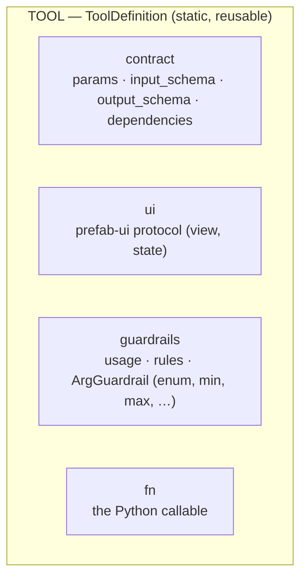
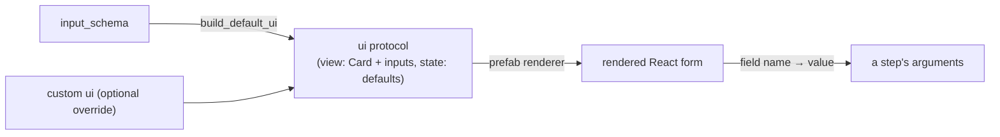
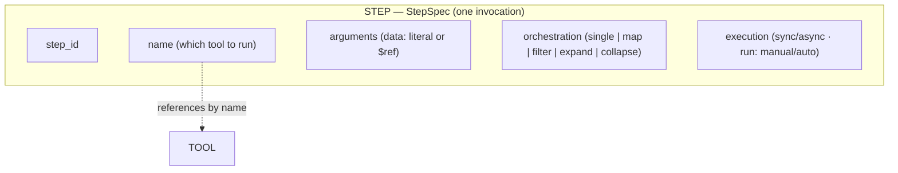
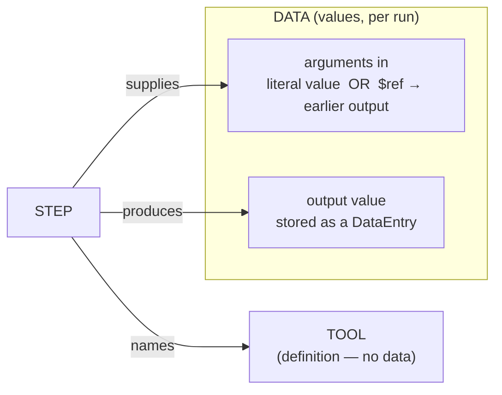
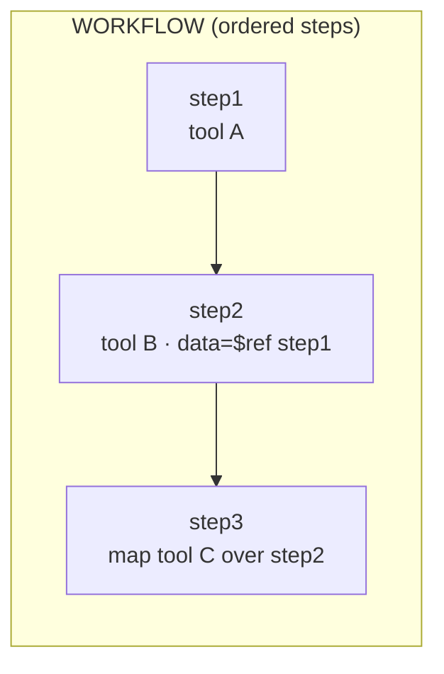
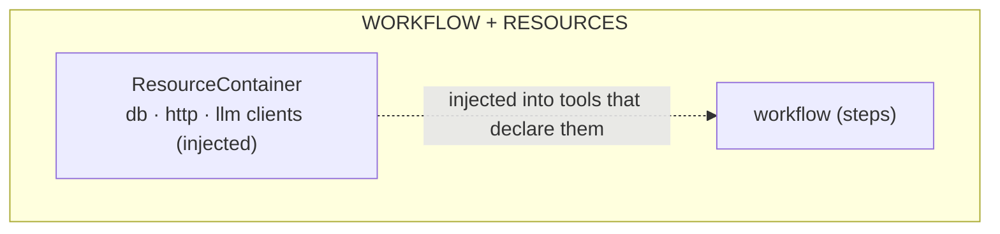
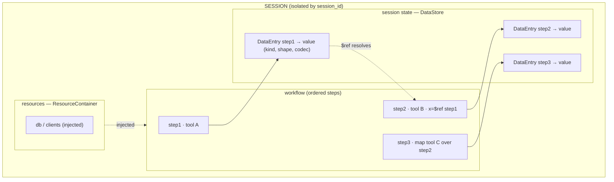

# How simple-steps-core works

A top-to-bottom explanation of the library as it exists today: what each piece
is, why it exists, and how the pieces fit together to turn a plain Python
function into an orchestratable, session-aware, serializable tool.

> For task-oriented backend wiring, see the [Integration Guide](integration.md).
> For the forward-looking design (MCP/LangGraph adapters, structured `StepSpec`,
> agent planner), see [specs/011](../specs/011-tool-orchestration-and-agent-workflows.md).
> This page documents **what is built now**.

---

## 1. The big idea

`simple-steps-core` makes a Python function *easy to call in an orchestrated,
traceable way*. You **decorate** a function to register it as an **operation**,
then build a **workflow** of steps that call operations — wiring one step's
output into the next — and run them in an isolated **session**.

Two properties drive the whole design:

- **Tool-first**: operations are the only executable units. Nothing runs
  arbitrary source; a workflow is a list of validated calls to reviewed
  functions.
- **Structured & serializable**: a call is a data object (`ToolCall`), not a
  string. Everything — the operation's contract, the workflow, the session — is
  JSON-serializable so it can cross an API boundary, be stored, and be rebuilt.

This is the substrate for two use cases: exposing functions as tools (e.g. to an
MCP server or an LLM) and composing them into agentic workflows a user can trace
and run step-by-step.

---

## 2. Architecture at a glance

The code is layered so each layer depends only on the ones below it:

```
simple_steps_core/                    ← import only from the package root
│
├─ api/                    STABLE PUBLIC SURFACE
│  ├─ public.py            re-exports every name below (the only import point)
│  └─ decorators.py        register_operation (alias)
│
├─ serving.py              OPTIONAL HTTP LAYER  (needs the `api` extra)
│  ├─ build_app(registry, engine)   → FastAPI: GET /tools · POST /call · POST /run
│  ├─ load_tools_module(path)       import a user script (runs its decorators)
│  └─ main()                        console script `simple-steps-core-server`
│
├─ execution/              HOW things run + WHERE data lives
│  ├─ workflow.py   Workflow           ordered steps; run()/arun()/run_step();
│  │                                   author via  wf[id] = ToolCall | StepSpec
│  ├─ engine.py     CoreEngine          validate → resolve → inject → run → store
│  │               ExecutionHandle      handed to orchestrators for per-item sub-calls
│  ├─ resolver.py   ReferenceResolver   turns "step1.field" into the real value
│  ├─ context.py    SessionContext      facade over the two stores below
│  │  ├─ data_store.py  DataStore       all outputs as DataEntry records
│  │  │                 DataEntry       ref, value, step_id, kind, shape, codec, …
│  │  └─ resources.py   ResourceContainer  injected db/clients (never serialized)
│  ├─ session_io.py     SessionSnapshot · CodecRegistry · DEFAULT_CODECS
│  │                                    structure + payloads persistence
│  └─ session_manager.py SessionManager · make_session_id   per-user isolation
│
├─ operations/             WHAT a tool is; introspection; checking
│  ├─ registry.py   Operation           dual-mode: op(**kw)→ToolCall / op.run(**kw)
│  │               OperationRegistry    name→op; list_definitions(); freeze()
│  │               register_operation   the decorator
│  ├─ schema.py     build_input_schema / build_output_schema   (JSON Schema)
│  ├─ dependencies.py  Resource()       marks an injected resource parameter
│  ├─ validation.py    validate_tool_call   do the args satisfy the contract?
│  └─ orchestrations.py map · filter · expand · collapse + register_orchestrators
│
├─ domain/                 PURE shapes + grammar  (depends on NOTHING above)
│  ├─ models.py     ToolCall            {operation_id, arguments}      ← the call
│  │               StepSpec            {name, arguments, orchestration, execution}
│  │               OrchestrationConfig · ExecutionConfig
│  │               Step · StepOutput · StepResult · Shape · Cell · StepError
│  │               OperationDefinition · OperationParam           ← the contract
│  │               MapResult · ItemOutcome                 ← orchestrator results
│  └─ references.py is_reference / split_reference    grammar: token starts with `step`
│
└─ packs/  loader.py       load a module of operations at boot
```

**The one rule that prevents leaky abstractions:** dependencies point *downward
only* — `api → serving → execution → operations → domain`. No layer imports a
layer above it. `domain` is pure data (Pydantic + grammar) and imports nothing
else; `operations` never touches a live session; `execution` is the only place
with runtime state.

Import everything from the top-level package:

```python
from simple_steps_core import (
    register_tool, REGISTRY, ToolRegistry,
    CoreEngine, Workflow, SessionContext, ToolCall,
    Resource, ResourceContainer,
    register_orchestrators, validate_tool_call,
)
```

**Terminology:** *tool* and *operation* are the same thing — `register_tool` /
`register_operation`, `ToolRegistry` / `OperationRegistry`, `ToolDefinition` /
`OperationDefinition`, `ToolParam` / `OperationParam` are interchangeable
aliases; **`tool` is the preferred name**. The serialized field stays
`operation_id` (also readable as `.tool_id`).

### What crosses each boundary

Only these small, well-defined objects move between layers — everything else is
an internal detail:

| Crossing | Object | Direction |
| --- | --- | --- |
| author → engine | `ToolCall` (or `StepSpec`, compiled to one) | a call to run |
| registry → UI / agent | `OperationDefinition` (+ `input_schema`) | the tool contract |
| inside `ToolCall.arguments` | reference token `"step1.field"` | wiring, resolved at run time |
| engine → session | `ref` string + `DataEntry` | where an output went |
| session → disk/DB | `SessionSnapshot` | persistence |
| tool ← container | a resource object (db/client) | injected, never serialized |

### Lifecycle of one step

```
Workflow.run_step("step2")
└─ step.call : ToolCall(operation_id="total", arguments={"data": "step1"})
   └─ CoreEngine.execute(call, ctx)
      ├─ 1. validate_tool_call(call, registry)        operations/validation
      ├─ 2. ReferenceResolver.resolve_arguments(...)  "step1" → value   (reads session)
      ├─ 3. inject resource params from ctx.resources execution/resources
      ├─ 4. run the function
      │     ├─ sync         → asyncio.to_thread(fn, **args)
      │     ├─ async        → await fn(**args)
      │     └─ orchestrator → fn(handle, **args)  → drives sub-ops per item
      └─ 5. ctx.data.put(ref, value) → DataEntry ; bind "step2" → ref
         └─ back on the Step: status=COMPLETED, output.ref/value set
```

A `StepSpec` adds one step in front of this: `StepSpec.to_tool_call()` compiles
it to the `ToolCall` above (a `single` step → a direct call; `map`/`filter`/
`expand`/`collapse` → a call to that orchestrator with the step's tool as `op`).

---

## The object model: tool → step → workflow → session

The module tree above is the *code* stack. This is the *object* stack — built up
one layer at a time, separating the reusable **tool** from the **data** that
flows through it, up to the **session** that holds a whole run.

### 1. The tool (a definition — static, reusable, holds no data)

A tool is defined once. It bundles four things: the **contract** (schema), the
**UI**, the **guardrails**, and the **callable**. None of these hold run data.



**How the UI component works.** The `ui` is auto-derived from the same
`input_schema`, so a tool is renderable with zero extra work; a user can also
supply their own. The frontend renders it and its inputs map back to a step's
arguments by field `name`:



### 2. The step (one *invocation* of a tool + how to run it)

A step doesn't contain a tool — it **names** one, and adds the run-specific
config (arguments, orchestration, execution). This is where tool and data first
meet.



### 3. Separating the tool from the data

The **tool** is the *definition* (what can run — reused by many steps and runs).
The **data** is the *values* (this run's inputs and outputs). The tool never
holds data; data lives in the session, addressed by reference.



### 4. The workflow (an ordered list of steps)



### 5. The workflow with resources

Tools that declare `Resource()` params need runtime objects (db/clients). Those
live in a **ResourceContainer** beside the workflow — injected at run time,
never part of the data flow, never serialized.



### 6. The session (workflow + resources + session state)

A **session** is one isolated run: the **workflow** (the list of steps), the
**resources**, and the **session state** — a `DataStore` holding each step's
output as a self-describing `DataEntry`. References resolve *out of* this state.



So, top to bottom: a **tool** (definition + UI + guardrails + fn) is invoked by
a **step** (which adds data + orchestration), steps are ordered into a
**workflow**, and a **session** wraps that workflow with its **resources** and
the **DataStore** that holds every step's produced **data**.

---

## 3. Tools (operations) — the decorated function

A **tool** (a.k.a. **operation**) is a registered Python function: the real unit
of work (load a CSV, filter rows, call an API). You register one with
`@register_tool`:

```python
from simple_steps_core import register_tool

@register_tool("make_list", description="Create [0..n-1]")
def make_list(n: int) -> list[int]:
    return list(range(n))
```

The decorator returns an `Operation` wrapper (not the raw function) that works in
**two modes**:

```python
call  = make_list(n=5)      # DEFERRED  -> a ToolCall (nothing runs yet)
value = make_list.run(n=5)  # IMMEDIATE -> [0, 1, 2, 3, 4] (runs now)
```

- **Deferred** (`make_list(n=5)`) builds a `ToolCall` you can store in a workflow
  and execute later. This is the Airflow/Prefect "task" pattern.
- **Immediate** (`make_list.run(...)`) is the escape hatch that calls the
  underlying function right away.

Coroutine functions are detected automatically (`is_async`), so the engine knows
to `await` them.

---

## 4. Parameters: data vs. resource

Every parameter is classified at registration time into one of two **kinds**:

- **data** — a value the caller supplies (a number, string, list, model). It
  appears in the operation's JSON Schema.
- **resource** — a runtime object the function needs but that is *not* part of
  the data flow (a DB connection, an HTTP/LLM client, config). It is **injected**
  from the session at run time and is **hidden from the schema** so an agent
  never sees or supplies it.

Mark a resource by giving the parameter a `Resource()` default:

```python
from simple_steps_core import register_operation, Resource

@register_operation("load_orders")
def load_orders(region: str, db: Database = Resource()) -> list[dict]:
    return db.query("SELECT * FROM orders WHERE region = ?", region)
```

Here `region` is **data** (in the schema, supplied by the caller) and `db` is a
**resource** (injected, excluded from the schema, recorded in the definition's
`dependencies`). `Resource("name")` overrides the container key; it defaults to
the parameter name.

> A **reference** (§7) is not a third kind — it's a *data* parameter whose value
> happens to be a pointer to an earlier step's output.

---

## 5. The contract: OperationDefinition + JSON Schema

Registering a function introspects its signature into an `OperationDefinition` —
the operation's public, JSON-serializable contract:

```python
d = REGISTRY.get_definition("load_orders")
d.operation_id   # "load_orders"
d.description     # first paragraph of the docstring (or the given description)
d.params          # [OperationParam(name="region", kind="data", required=True, ...),
                  #  OperationParam(name="db", kind="resource", required=True, ...)]
d.input_schema    # JSON Schema for the DATA params only
d.output_schema   # JSON Schema derived from the return annotation
d.dependencies    # ["db"]  — the resource params
```

`input_schema` / `output_schema` are real JSON Schema, generated from the type
annotations via Pydantic (`operations/schema.py`). For example, `region: str`
produces:

```json
{
  "type": "object",
  "properties": { "region": { "type": "string" } },
  "required": ["region"],
  "additionalProperties": false
}
```

This schema is the shared currency for a UI form, an MCP tool, or an LLM
function-calling tool — one signature, one schema, no hand-maintained duplicates.

### UI and guardrails

Each `OperationDefinition` also carries two optional, serializable fields:

- **`ui`** — a [prefab-ui](https://prefab.prefect.io) protocol document
  (`{"view": <component tree>, "state": {...}}`). It is **auto-built** from the
  `input_schema` (a `Card` form, one input per data param) unless you pass your
  own, so any tool renders out of the box and any tool can bring a custom UI.
  When the tool has `guardrails`, they also **shape the default form** — an
  argument `enum` becomes a dropdown, numeric bounds/lengths/patterns become
  input attributes, and the note becomes help text:
  ```python
  @register_tool("pick_region", ui=my_prefab_protocol)   # override the default
  def pick_region(region: str): ...
  ```
  The `ui` (prefab) is for a React frontend. A single tool can also carry
  renderers for *other* surfaces by passing a `{target: renderer}` map — e.g.
  the optional **Streamlit dashboard** reads `ui={"streamlit": fn}`:
  ```python
  @register_tool("pick_region", ui={"streamlit": render_pick})
  def pick_region(region: str): ...
  ```
  Every tool exposes a `ToolUI` (`operation.ui`) that holds these views keyed by
  target; the `prefab` view is always present (auto-built when omitted). Look one
  up with `registry.ui_for("pick_region", "streamlit")` (defaults to `"prefab"`).
  All targets are just renderers of the same contract.
- **`guardrails`** — a `Guardrails` policy: `usage`/`rules` (guidance the UI and
  agent read), safety flags (`read_only`/`destructive`/`requires_confirmation`),
  and per-argument constraints (`ArgGuardrail`: `enum`/`minimum`/`maximum`/
  `min_length`/`max_length`/`pattern`) that are **enforced** by
  `validate_tool_call` on literal values (references are checked at run time):
  ```python
  @register_tool("charge", guardrails=Guardrails(
      usage="Only after the user confirms the amount.",
      destructive=True, requires_confirmation=True,
      arguments={"amount": ArgGuardrail(minimum=0.01, maximum=10_000)}))
  def charge(amount: float): ...
  ```

---

## 6. ToolCall — a structured invocation

A `ToolCall` is the canonical, durable representation of "run operation X with
these arguments":

```python
from simple_steps_core import ToolCall

ToolCall(operation_id="load_orders", arguments={"region": "EMEA"})
```

It is a frozen Pydantic model, so it serializes with `.model_dump_json()` and
loads with `.model_validate_json()`. Deferred operation calls build these for
you (`load_orders(region="EMEA")` returns exactly this object).

> There is no string "formula" layer — the `ToolCall` **is** the encoding.

---

## 7. References — wiring one step's output into another

An argument can be a literal, **or** a reference to a prior step's output. A
reference is a string token that names a step:

```python
"step1"           # the whole output of step1
"step1.total"     # the `total` field/attribute of step1's output
"step1.rows[0]"   # indexed access
```

The grammar (in `domain/references.py`) requires the token to **start with
`step`**. Two helpers expose it:

```python
from simple_steps_core import is_reference, split_reference
is_reference("step1.total")     # True
split_reference("step1.total")  # ("step1", "total")
```

At run time the engine replaces reference tokens with the real value from the
session before calling the function. Because a reference stands in for any type,
`validate_tool_call` lets it pass without type-checking — but a reference's type
is still knowable and checked in two ways:

- **Statically** — `check_reference_types(workflow, registry)` compares each
  reference's producing tool `output_schema` against the consuming parameter's
  type and returns issues (`unknown step`, ordering, definite type mismatch).
  Great for authoring feedback in the UI/agent; best-effort (skips cases it
  can't type, like dotted fields on a `dict` or `MapResult.ok`).
- **At run time** — after resolution, the engine re-applies the tool's
  `ArgGuardrail`s to the now-real value, so a reference whose resolved value
  violates a constraint fails the step with a clear error.

---

## 8. The Registry — the palette

The `OperationRegistry` holds every registered operation and lets you discover
them. There is a global singleton `REGISTRY`, or you can make an isolated one:

```python
from simple_steps_core import OperationRegistry, register_orchestrators

registry = OperationRegistry()
registry.register("make_list", make_list, description="Create [0..n-1]")
register_orchestrators(registry)   # add map/filter/expand/collapse
registry.freeze()                  # read-only for the process lifetime
```

- `list_definitions()` → the whole palette (`list[OperationDefinition]`) — this
  is what a frontend enumerates to render forms or nodes.
- `get_definition` / `get_operation` / `get_callable` / `has` — lookups.
- `freeze()` makes the registry read-only so concurrent reads are safe without
  locks; registering after freeze raises `RegistryFrozenError`.

Register all operations at startup, then freeze.

---

## 9. Validation

Before anything runs, `validate_tool_call(call, registry)` checks a call against
its operation's contract:

```python
from simple_steps_core import validate_tool_call, ValidationError
```

It raises `ValidationError` when the operation is unknown, an unexpected argument
is supplied, or a required argument is missing. Reference tokens count as
"present" and skip type-checking; only literal values are type-checked (via a
per-operation Pydantic model). Resource parameters are excluded — they're never
caller-supplied.

---

## 10. The Engine — the execution pipeline

`CoreEngine` turns a `ToolCall` into a result. For each call it runs four steps:

```
ToolCall ─▶ 1. validate ─▶ 2. resolve references ─▶ 3. inject resources ─▶
           4. run (sync in a thread / async awaited / orchestrator w/ handle)
        ─▶ store the value under a fresh ref  ─▶  returns (ref_id, value)
```

```python
engine = CoreEngine(registry)
ref_id, value = engine.execute(ToolCall(operation_id="make_list",
                                         arguments={"n": 5}), context)
```

- **`execute` / `aexecute`** — sync and async entry points. `execute` runs plain
  sync ops inline and drives async/orchestrator ops to completion (it refuses to
  nest inside a running event loop — use `aexecute` there).
- Sync functions run off the event loop via `asyncio.to_thread` so they can't
  stall it; async functions are awaited.
- **`execute_step` / `aexecute_step`** return a reference-only `StepResult`
  (status + shape + error), the shape used by the runtime contract.
- **Resource injection**: the engine reads each resource parameter from
  `context.resources` and passes it in. A missing resource raises
  `ResourceMissingError`.
- **Orchestrators** receive an `ExecutionHandle` as their first argument so they
  can run sub-operations over a collection while sharing this engine and session.

Every produced value is stored under a unique, session-scoped `ref_id`; the
caller gets back both the lightweight reference and the value.

---

## 11. The Session — where data and resources live

Domain models never carry heavy payloads. Live data lives in the **session**,
addressed by reference. `SessionContext` is the facade over two components:

```python
from simple_steps_core import SessionContext
ctx = SessionContext(session_id="run-1")
ctx.data        # DataStore        — all step outputs, richly described
ctx.resources   # ResourceContainer — injected runtime resources
```

### DataStore + DataEntry

Every output is wrapped in a self-describing `DataEntry`, so the UI and snapshot
layers can reason about it without touching the raw object:

```python
DataEntry(
    ref="run-1__ab12", value=<DataFrame>, step_id="step1",
    kind="dataframe",
    shape=Shape(kind="dataframe", rows=5000, columns=["id", "total"]),
    codec="dataframe", ephemeral=False, created_at=<utc>,
)
```

Convenient access on the context:

```python
ctx.value_for_step("step1")      # the payload a step produced
ctx.entry("run-1__ab12")         # the full DataEntry (metadata)
ctx.get_meta(ref)                # Shape (rows/columns/type)
ctx.get_view(ref, offset, limit) # paginated, JSON-safe list[Cell] for a grid
```

`ctx.outputs` (ref→value) and `ctx.step_to_ref` (step→ref) remain available as
back-compat views backed by the store.

### ResourceContainer

Runtime resources are registered per session and created lazily:

```python
ctx.resources.register("db", lambda: connect_db())   # factory (lazy)
ctx.resources.register_value("client", http_client)  # already-built instance
ctx.resources.get("db")                              # instantiate + cache
ctx.resources.aclose()                               # close at session end
```

Resources have their own lifecycle and are **never serialized** — on session
load they're rebuilt from their factories.

---

## 12. Workflows — authoring and running steps

A `Workflow` is an ordered collection of steps plus the machinery to run them
against a session. Author it with a dict-like API, assigning `ToolCall`s:

```python
from simple_steps_core import Workflow

wf = Workflow(engine, session_id="run-1")
wf["step1"] = make_list(n=5)             # a ToolCall
wf["step2"] = total(data="step1")         # references step1's output

wf.run()                                   # run all steps in order
# or:
wf.run_step("step1")                       # run a single step (trace/re-run)
await wf.arun()                            # async (orchestrators fan out inside)
```

Each `Step` records its lifecycle as it runs:

```python
s = wf["step2"]
s.call            # ToolCall(operation_id="total", arguments={"data": "step1"})
s.status          # StepStatus.COMPLETED
s.output.value    # the produced value (also in the session by ref)
s.error           # None, or the failure message
```

Steps run in insertion order because a later step may reference an earlier one.
A **DAG** is derivable by scanning each step's `call.arguments` for reference
tokens (`is_reference` + `split_reference`) — that's how the example server's
`/dag` endpoint builds graph edges.

### StepSpec — declaring orchestration when you define the step

Instead of assigning a raw `ToolCall`, you can assign a `StepSpec`: it names the
tool and declares **inline** how to orchestrate and execute it. The workflow
compiles it to the executable `ToolCall` and keeps the spec on the step for
tracing.

```python
from simple_steps_core import StepSpec, OrchestrationConfig

wf.add(StepSpec(step_id="step_nums", name="make_list", arguments={"n": 4}))
wf.add(StepSpec(                       # run `square` over each item of step_nums
    step_id="step_squared",
    name="square",
    orchestration=OrchestrationConfig(mode="map", over="step_nums", concurrency=4),
))
wf.run()
wf["step_squared"].spec.orchestration.mode   # "map"  (intent retained)
```

- `OrchestrationConfig` — `mode` (`single`/`map`/`filter`/`expand`/`collapse`),
  `over` (collection reference), `item_arg`, `concurrency`, `on_error`,
  `retries`, `initial` (for `collapse`).
- `ExecutionConfig` — `mode` (`sync`/`async`), `run` (`auto`/`manual`),
  `timeout`, `retries`, `cache`.

A `single` step compiles to a direct call; the orchestrated modes compile to the
matching orchestrator with this step's tool as the per-item `op`. An orchestrated
step's `arguments` become **shared constant** keyword arguments passed to every
per-item sub-call (the item fills the tool's item parameter); they should be
literals — the collection itself goes in `orchestration.over`.

### Stages — grouping steps into phases

A step may declare a `stage` (an int or string). Stages let you run the workflow
in groups — e.g. run stage 0, inspect, then run stage 1 — instead of all at once.

```python
wf.add(StepSpec(step_id="step_load",  name="load",    stage=0))
wf.add(StepSpec(step_id="step_clean", name="clean",   stage=0, arguments={"data": "step_load"}))
wf.add(StepSpec(step_id="step_report",name="report",  stage=1, arguments={"data": "step_clean"}))

wf.stages()            # [0, 1]  (first-appearance order)
wf.run_stage(0)        # runs step_load + step_clean only
wf.run_stage(1)        # runs step_report (references stage 0's outputs)
wf.run_by_stages()     # runs every stage in order (async: arun_stage / arun_by_stages)
```

Steps within a stage still run **sequentially** (a later step may reference an
earlier one, even in the same stage); the stage is a grouping/checkpoint
boundary, not a parallel batch. Steps assigned as a raw `ToolCall` (no spec) are
ungrouped (`stage=None`).

---

## 13. Orchestrators — applying an operation across a collection

`register_orchestrators(registry)` adds four higher-order operations that apply
an existing operation across a collection produced by a prior step:

| Orchestrator | Effect | Default `on_error` |
| --- | --- | --- |
| `map` | run `op` for each item → `MapResult` | `collect` |
| `filter` | keep items where the predicate is truthy | `skip` |
| `expand` | flat-map (1 → many, flattened) | `collect` |
| `collapse` | reduce N → 1 with a 2-arg op | fail-fast |

They're called like any operation — via a `ToolCall` whose arguments carry the
orchestration settings:

```python
wf["step_nums"]   = make_list(n=5)
wf["step_double"] = ToolCall(operation_id="map", arguments={
    "over": "step_nums",     # a reference to the collection
    "op": "double",           # the sub-operation id
    "concurrency": 8,          # parallel items (asyncio.Semaphore)
    "on_error": "collect",    # collect | fail_fast | skip
    "retries": 2,
})
wf.run()

result = wf.context.value_for_step("step_double")   # MapResult
result.ok           # successful values, in order
result.failed       # list of ItemOutcome (index, error)
result.ok_count / result.failed_count
```

`map` returns a `MapResult` whose `.ok` / `.failed` are themselves referenceable
(`"step_double.ok"`), so you can feed successes onward or re-drive only failures.
`over` must be a quoted reference string; each item binds to the sub-op's first
required data parameter (override with `arg=`).

---

## 14. Persistence — structure vs. full session

Two levels of save/load:

- **Structure only** (`to_json` / `from_json`): the steps (calls + status), no
  payloads. Re-runs from scratch.

  ```python
  data = wf.to_json()
  wf2  = Workflow.from_json(data, engine, session_id="run-2")
  ```

- **Full session** (`export_session` / `import_session`): structure **and**
  payloads, so a restored workflow exposes its computed data again.

  ```python
  snapshot_json = wf.export_session_json()          # store in a DB
  wf2 = Workflow.import_session_json(snapshot_json, engine)
  wf2.context.value_for_step("step2")               # payload is back
  ```

Payloads are serialized through a `CodecRegistry` (`session_io.py`). JSON-native
values and Pydantic models round-trip automatically; for other types (e.g. a
`DataFrame`) register a codec **before** exporting. Pickle is intentionally *not*
used (arbitrary-code-execution risk); a value with no codec is treated as
**ephemeral** — kept in the live session but omitted from snapshots and
recomputed on re-run.

---

## 15. Multi-user isolation

For a server handling many users, `SessionManager` gives each run its own
session with a per-session `asyncio.Lock`, and `make_session_id` builds a stable
key:

```python
from simple_steps_core import SessionManager, make_session_id

SESSIONS = SessionManager()
sid = make_session_id("alice", "wf-001", "run")
await SESSIONS.get_or_create(sid)
async with SESSIONS.lock(sid):
    await wf.arun()
```

Register operations once and `freeze()` the registry (shared, read-only);
isolate per-run *data* in separate `SessionContext`s.

---

## 16. End-to-end example

Everything above, together — a resource, data args, a reference, and a `map`:

```python
from simple_steps_core import (
    OperationRegistry, CoreEngine, Workflow, ToolCall,
    Resource, register_operation, register_orchestrators,
)

registry = OperationRegistry()

def load_orders(region: str, db=Resource()) -> list[dict]:   # data + resource
    return db.fetch(region)

def order_total(order: dict) -> float:                        # sub-op for map
    return sum(line["price"] for line in order["lines"])

registry.register("load_orders", load_orders)
registry.register("order_total", order_total)
register_orchestrators(registry)
registry.freeze()

engine = CoreEngine(registry)
wf = Workflow(engine, session_id="alice__wf1__run1")
wf.context.resources.register("db", lambda: OrderDB())   # provide the resource

wf["step_orders"] = ToolCall(operation_id="load_orders", arguments={"region": "EMEA"})
wf["step_totals"] = ToolCall(operation_id="map", arguments={
    "over": "step_orders", "op": "order_total", "concurrency": 8,
})
wf.run()

totals = wf.context.value_for_step("step_totals")        # MapResult
print(totals.ok, totals.failed_count)
```

- `region` is data the caller set; `db` is a resource injected from the session.
- `step_totals` references `step_orders`; the engine resolves it to the loaded
  list before `map` fans `order_total` across it.
- Results land in the session by reference and are inspectable per step.

---

## 17. How this maps to MCP & agents (and what's next)

The pieces above are exactly what MCP tools and LLM function-calling need:

- `OperationDefinition.input_schema` is MCP-/OpenAI-native JSON Schema.
- `dependencies` (resources) are automatically hidden from that schema.
- A `ToolCall` is one call; a `Workflow` is an ordered list of calls with
  references — richer than a flat MCP `tools/call` batch.

**Not yet built** (see [specs/011](../specs/011-tool-orchestration-and-agent-workflows.md)):

- **Adapters** to export tools to an MCP server / import remote MCP tools, and
  to LangGraph / OpenAI.
- An **agent planner** that proposes a whole `list[StepSpec]` for a user to
  trace, edit, and run.
- Pluggable **checkpointers** and a cross-session long-term store.

---

## 18. Where things live (quick map)

| Concept | Module | Key names |
| --- | --- | --- |
| Decorator / registry | `operations/registry.py` | `register_operation`, `OperationRegistry`, `REGISTRY`, `Operation` |
| Resource marker | `operations/dependencies.py` | `Resource` |
| JSON Schema | `operations/schema.py` | `build_input_schema`, `build_output_schema` |
| Validation | `operations/validation.py` | `validate_tool_call`, `ValidationError` |
| Orchestrators | `operations/orchestrations.py` | `register_orchestrators` |
| Models | `domain/models.py` | `ToolCall`, `Step`, `OperationDefinition`, `OperationParam`, `MapResult` |
| References | `domain/references.py` | `is_reference`, `split_reference` |
| Engine | `execution/engine.py` | `CoreEngine`, `ExecutionHandle` |
| Session | `execution/context.py` | `SessionContext` |
| Data store | `execution/data_store.py` | `DataStore`, `DataEntry` |
| Resources | `execution/resources.py` | `ResourceContainer`, `ResourceMissingError` |
| Workflow | `execution/workflow.py` | `Workflow` |
| Snapshots | `execution/session_io.py` | `SessionSnapshot`, `CodecRegistry`, `DEFAULT_CODECS` |
| Multi-user | `execution/session_manager.py` | `SessionManager`, `make_session_id` |
| Public API | `api/public.py` | everything above, re-exported |
