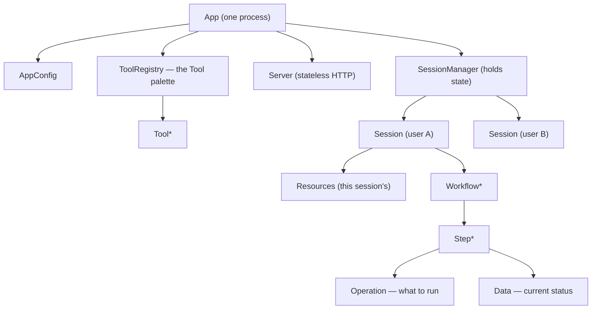
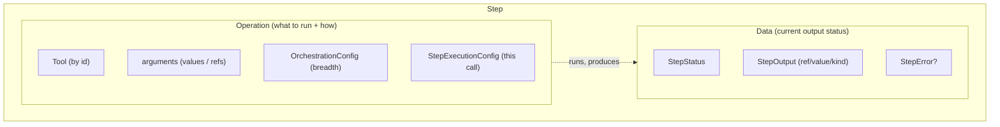
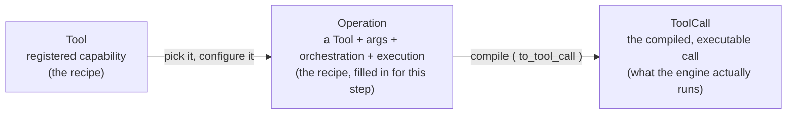
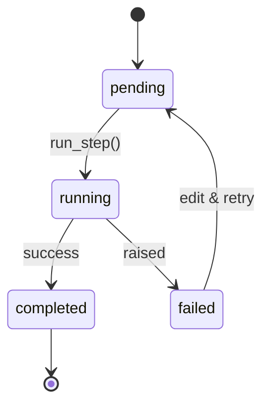
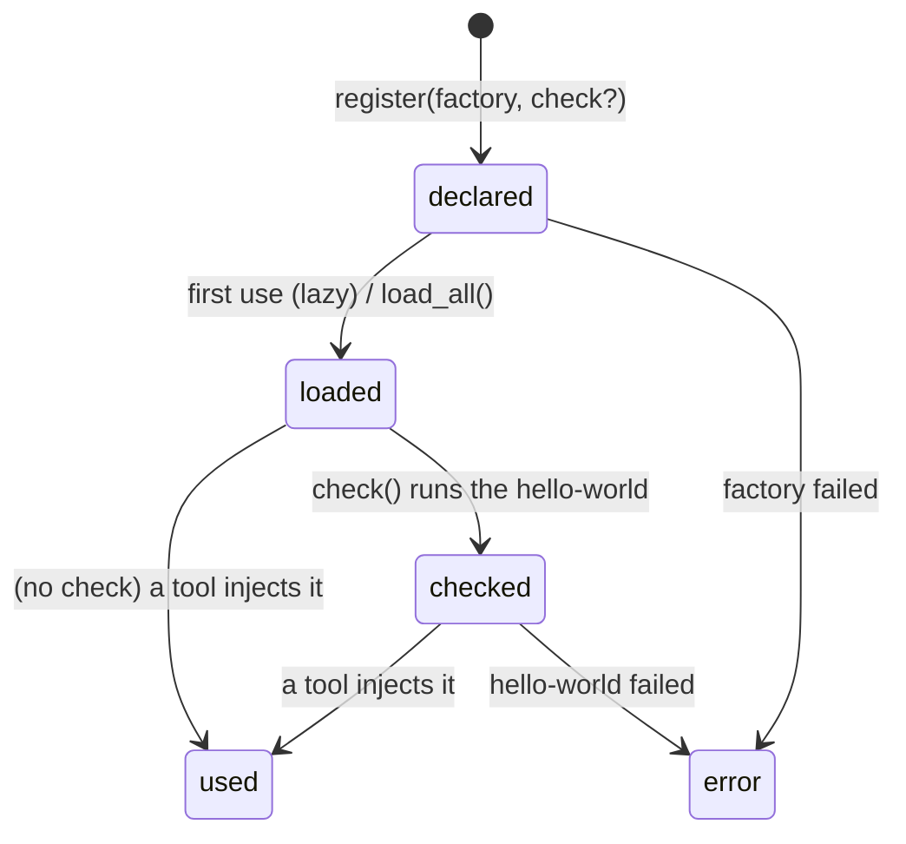
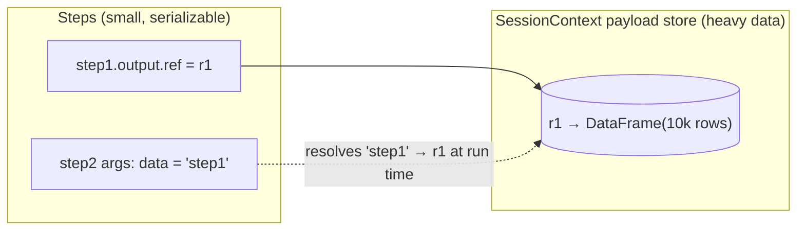
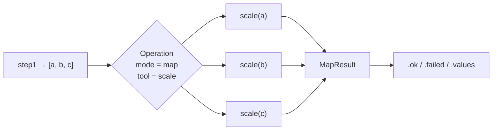
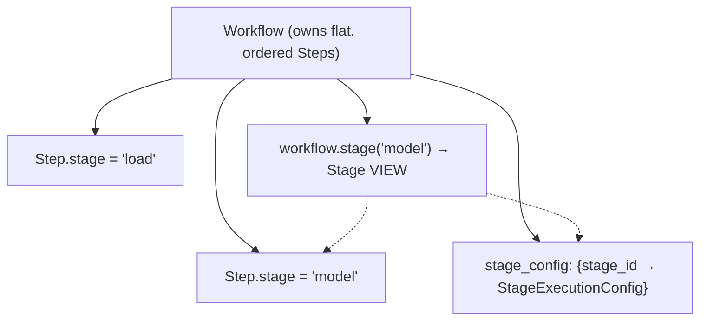

# Simple Steps — Object Model (top-down)

This is the canonical vocabulary for the library, read from the top (the whole
running system) down to the smallest unit (a tool's parameter). Every object a
user is expected to hold and inspect exposes two things:

- `__repr__` — one dense line, safe for logs (no payloads).
- `info()` — a rich, tabular `SummaryTable` (renders as a table in notebooks via
  `_repr_html_`, prints as aligned text via `__str__`). Never dumps payloads —
  only shapes, counts, and status.

> **Naming note (Option A).** "Tool" is the registered capability. "Operation"
> is a Tool *equipped* with orchestration + execution + arguments — i.e. the
> body of a Step. So a **Step = Operation + Data** literally.

---

## The hierarchy at a glance

```
App                         the whole system (one process)
├─ AppConfig                system/app details (title, host, storage, session policy)
├─ ToolRegistry             the palette of registered Tools
│   └─ Tool                 one registered capability
│       ├─ ToolDefinition   its public contract (id, description, schema)
│       │   └─ ToolParam    one parameter of the contract
│       └─ Guardrails       usage policy + per-argument constraints
├─ Resources                runtime dependencies injected into tools (db, llm, ...)
├─ Server                   STATELESS HTTP launcher (exposes tools/sessions over HTTP)
└─ SessionManager           owns all live Sessions (state lives here)
    └─ Session              one user's isolated working area
        ├─ Resources        resources available to this session
        └─ Workflow*        one or more workflows (a session can hold many)
            ├─ WorkflowExecutionConfig   how STAGES run (ordering, on_stage_error, gate)
            ├─ stage_config  {stage_id → StageExecutionConfig}   how a stage's STEPS run
            └─ Step*        ordered steps (the "columns" of the workflow)
                ├─ stage        tag → membership in a Stage (a groupby view)
                ├─ Operation    what to run  (Tool + how)
                │   ├─ Tool            which capability (by id)
                │   ├─ arguments       literal values / references to earlier steps
                │   ├─ OrchestrationConfig     breadth: single | map | filter | expand | collapse
                │   └─ StepExecutionConfig     how THIS call runs (timeout, retries, cache, gate)
                └─ Data         current status of the step's output
                    ├─ StepStatus     pending | running | completed | failed
                    ├─ StepOutput     ref + optional inline value + kind
                    └─ StepError      structured failure (message, type, traceback)
```

`*` = repeatable (a SessionManager has many Sessions, a Session has many
Workflows, a Workflow has many Steps).

---

## Visual model

### A. Containment — who owns what



### B. A Step is exactly `Operation + Data`



### C. Tool → Operation → ToolCall (the three easy-to-confuse things)



> **Rule of thumb:** you *author* Operations; the engine *runs* ToolCalls. A
> Tool is the reusable thing both refer to.

### D. Step status — the lifecycle of `Data`



### E. Resource lifecycle — declare → load → check → use



### F. References & the payload store (why big data isn't on the model)



> Steps stay tiny (just a reference); the real DataFrame/list lives in the
> session store, addressed by `ref`. Later steps point at earlier steps by a
> **string token** (`"step1"`, `"step1.field"`), which forms the DAG.

### G. Orchestration — one Operation, applied across a collection



---

## 1. `App` — the whole system

The top-level facade for one process. It owns the static configuration and the
tool palette, and it composes the two runtime halves:

- a **stateless** `Server` (turns tools/sessions into an HTTP API), and
- a **stateful** `SessionManager` (holds every live `Session`).

**Holds:** `AppConfig`, `ToolRegistry` (tools), `Resources`, `Server`,
`SessionManager`.

`app.info()` → four sections:

| AppConfig | Tools | Resources | Sessions |
|---|---|---|---|
| title, host, port, storage, session policy | count + ids/categories | names + bound/unbound | id, user, #workflows, activity |

---

## 2. `AppConfig` — system & app details

Plain, serializable settings: `title`, `host`, `port`, storage/mount options,
session-management policy, and load flags (`orchestrators`, `freeze`). No
behavior — read by `App`/`Server` at startup.

---

## 3. `Server` — stateless HTTP launcher

Exposes the app over HTTP. Holds **no** state itself; every request is handed a
fresh working area from the `SessionManager`. Endpoints (current):

- `GET /tools` — the palette (id, description, JSON Schema)
- `POST /call` — run one tool once
- `POST /run` — run a workflow of steps

---

## 4. `SessionManager` — owns the state

Hands out one isolated `Session` per `session_id` (recommended id:
`make_session_id(user_id, workflow_id, run_id)`), plus a per-session lock so one
user's writes serialize while other users run concurrently. This is where all
mutable runtime state lives.

`session_manager` holds many **Sessions** (e.g. one per user).

---

## 5. `Session` — one user's isolated area

A per-user, per-run working area. Owns the payload store (produced values live
here, addressed by reference) and the session's `Resources`. A session can hold
**many Workflows**.

`session.info()` →

| Session details | Tools / Resources | Workflows |
|---|---|---|
| id, user, created, activity | what's available to this session | id, #steps, status rollup |

---

## 5.1 Resources — lifecycle: declare → load → check → use

A **Resource** is a connection to the outside world that a tool needs but that
is not part of the data flow: a database connection, an LLM/API client, a config
object. Tools declare them with a `Resource()` default; the engine injects them
at run time and hides them from the tool's schema.

Resources move through up to four phases:

| Phase | What it does | Cost | When |
|---|---|---|---|
| **Declare** | write down *how* to build it (a factory) | instant | at session setup |
| **Load** | actually build it / open the connection | maybe slow | lazily on first use (default), or eagerly via `load_all()` |
| **Check** *(optional)* | run a tiny "hello world" to prove it works | a real call | manually, before a big batch |
| **Use** | tools call it for real | — | during `run()` |

**Declare** (a factory), with an **optional** `check`:

```python
session.resources.register("llm", factory=lambda: OpenAIClient())          # no check
session.resources.register(
    "db",
    factory=lambda: connect(DSN),
    check=lambda db: db.execute("SELECT 1"),                               # opt-in hello-world
)
```

**Load** — lazy by default (built on first use); `session.resources.load_all()`
forces eager construction for fail-fast setups.

**Check** — entirely optional. The library can't guess a valid trivial call for
an arbitrary resource, so the user supplies it via `check=`:

- `session.resources.check("llm")` — runs the hello-world, returns a result.
- `session.resources.check_all()` — smoke-tests every resource; **tests all and
  reports** (does not stop at the first failure).
- If a resource was registered **without** a `check`, `check()` falls back to a
  weaker test — "can it load without error?" — and reports `skipped`/`ok`
  accordingly rather than failing.

Each check returns a small, inspectable result: `status` (`ok` | `failed` |
`skipped`), `latency`, optional `sample` (what the call returned), and `error`.

```
llm   ✓ ok       0.42s   reply="Hi!"
db    ✓ ok       0.01s
cache ⊘ skipped          (no check provided)
```

**Preflight** (automatic, on `workflow.run()`) is separate and cheap: it only
verifies every resource a workflow's tools require is **registered**, and hard-
fails early with one clear message ("Missing resources: db, llm") before any
step executes. It never *loads* or *checks* — that stays opt-in.

Ownership is two-tier: `App` declares default resource factories; each `Session`
gets its **own** container seeded from them, so per-user overrides never mutate
the shared defaults. Resources are never serialized into snapshots — they are
rebuilt from their factories on load — and are closed via `aclose()` when the
session is discarded.

**`ResourceInfo`** (for `info()` / `__repr__`) carries: `name`, `type`,
`source` (`factory` | `value`), `status` (`declared` | `loaded` | `checked` |
`error`), `required_by` (tools that need it), and the last check result.

---

## 6. `Workflow` — an ordered list of Steps

The main authoring object: a dict-like, insertion-ordered collection of steps
that run against the session. Steps may be grouped into **stages** for staged
execution. Later steps reference earlier steps' outputs by token (`"step1"`,
`"step1.field"`).

`workflow.info()` → the spreadsheet view (columns = steps):

| | Step 1 | Step 2 | … | Step N |
|---|---|---|---|---|
| **Operation** | make_list | scale (map) | … | summarize |
| **Data** | done · list[5] | running | … | pending |

---

## 6.1 Stages — placement & configuration

A **Stage** groups a sequence of Steps so users can manage and run them as one
phase. It works like `df.groupby("stage")`: the **Workflow owns the flat, ordered
list of Steps**, each Step carries a `stage` tag, and a **`Stage` is a computed
view** over the steps sharing that tag — steps are never *moved into* a stage.

Two pieces, kept separate on purpose:

- **Membership** — the `stage` tag on the Step is the single source of truth for
  *which* steps belong. Steps in a stage need not be adjacent.
- **Configuration** — a `StageExecutionConfig` lives in a map on the Workflow
  keyed by stage id: `workflow.stage_config: {stage_id → StageExecutionConfig}`.
  A step with no stage, or a stage with no config, both work (defaults apply).



### Execution configs are **orthogonal and isolated** (no overriding)

There is **no cascade, no inheritance, and no overriding** between levels. Each
execution config owns the execution of exactly **one scope** and is enforced
independently. A missing value simply means *that scope imposes no such control*
— it is never filled in from another level.

| Config | Governs (its scope) | Owns | Enforced by |
|---|---|---|---|
| `WorkflowExecutionConfig` | how **stages** run | `stages` (sequential), `on_stage_error` (stop/continue), `run` (gate the workflow) | the Workflow runner |
| `StageExecutionConfig` | how a stage's **steps** run | `steps` (sequential/parallel), `concurrency`, `on_step_error` (stop/continue), `run` (gate the phase) | the Stage runner |
| `StepExecutionConfig` | how **one tool call** runs | `timeout`, `retries`, `cache`, `run` (gate the step) | the Engine |

Each config manages the level **directly below it** (or, for a Step, its own
call). Fields do **not** repeat across levels — except `run`, which is an
independent **gate per scope** (approve the workflow / a phase / a step). Gates
**compose** (all must pass); they never overwrite one another. Because the
scopes are disjoint there is **no precedence rule and no `resolved_config()`** to
remember — each config does exactly one job.

**Parallel safety:** `steps: parallel` (in `StageExecutionConfig`) is only valid
when the stage's steps do **not** reference each other (references resolve
lazily against already-run steps). The Workflow auto-checks for intra-stage
references and raises a clear error rather than silently racing.

> **Within-step parallelism is a different axis.** A single Step can still fan
> its Tool across a collection in parallel via `OrchestrationConfig(mode="map",
> concurrency=N)` — a parallel for-loop over *items*, living on the Operation,
> not on the stage. Stage parallelism = many *steps* at once; orchestration
> concurrency = many *items* at once. Two independent knobs.

### Future (deferred): `ExecutionPreset` / `OrchestrationPreset`

Optional authoring helpers to avoid retyping the same config on every step —
**deferred** until repetition actually hurts. Crucially these **stamp** (copy a
config's values onto each new step/stage at authoring time) rather than
**inherit** (look a value up at run time), so they add *zero* runtime cascade and
leave the isolated model above fully intact:

- `ExecutionPreset` — default `Step`/`Stage`/`Workflow` execution configs to
  stamp onto new steps/stages as they're added.
- `OrchestrationPreset` — default `OrchestrationConfig` (e.g. `mode="map"`,
  `concurrency=8`, `on_error="collect"`) to stamp onto new steps.

Because a preset copies values (they become concrete and local on each step),
there is still no inheritance, no precedence, and no `resolved_config()`. Build
only if hand-repetition becomes a pain in real use.

### The `Stage` view object ("manage a sequence as one thing")

`workflow.stage(id)` / `workflow.stages()` return lightweight views:

- `stage.steps` — its steps, in order
- `stage.config` — its `StageExecutionConfig` (defaults if unset)
- `stage.run()` — run just this phase (honors `StageExecutionConfig`)
- `stage.info()` — status rollup (n steps · x done / y pending / z failed)
- `stage.__repr__` → `<Stage 'model' · 2 steps · 1 done, 1 pending>`

---

## 7. `Step` — one column: **Operation + Data**

The atomic unit of a workflow. It pairs the thing to run with the current state
of what it produced:

- **Operation** — what to run and how (see §8).
- **Data** — the live status/output (see §9).

`step.info()` shows both halves side by side.

---

## 8. `Operation` — a Tool, equipped

A **Tool** plus everything needed to run it as a step. (This is the object
formerly called `StepSpec`.) It compiles to the executable call the engine runs.

Holds:

- **Tool** — which capability to run (by id).
- **arguments** — literal values or references to earlier steps.
- **`OrchestrationConfig`** — *breadth*: run once (`single`) or fan the tool
  across a collection (`map` / `filter` / `expand` / `collapse`), with `over`,
  `item_arg`, `concurrency`, `on_error`, `retries`, `initial`.
- **`StepExecutionConfig`** — governs **this single call** only: `timeout`,
  `retries`, `cache`, `run` (auto/manual gate). (`mode` sync/async is derived
  from the Tool, not configured.)

Orchestration (breadth) and step execution (this call) are orthogonal — and
neither cascades to or from the stage/workflow configs (see §6.1).

---

## 9. `Data` — the current status of a Step's output

A live, payload-free view of what the step has produced *so far*:

- **`StepStatus`** — `pending` → `running` → `completed` | `failed`.
- **`StepOutput`** — `ref` (key into the session store), optional inline
  `value` for small results, and `kind` ("dataframe", "list", …).
- **`StepError`** — structured failure (message, type, traceback) when failed.

The heavy payload never lives on the model; it stays in the session store,
addressed by `ref`.

---

## 10. `Tool` — a registered capability

A stable, human-authored Python function registered via `@register_tool`. It is
dual-mode: calling it defers (builds the call for a workflow); `.run(...)`
executes immediately.

- **`ToolDefinition`** — the public contract: `tool_id`, `description`,
  `category`, `type`, `params`, `input_schema`, `output_schema`,
  `dependencies` (resource params), `ui`, `guardrails`.
- **`ToolParam`** — one parameter: `name`, `type_name`, `required`, `default`,
  `kind` (`data` | `resource`).
- **`Guardrails`** — usage policy + per-argument constraints (`ArgGuardrail`).

---

## 11. Orchestrator outcomes (partial-failure results)

When a Step orchestrates a Tool over a collection, its Data is a structured,
per-item result:

- **`MapResult`** — aggregate: `.ok`, `.failed`, `.values`, `.ok_count`,
  `.failed_count`.
- **`ItemOutcome`** — one item: `index`, `status`, `value` | `error`.

---

## What your model doesn't name yet (gaps to be aware of)

Your top-down hierarchy is about the **nouns you hold and inspect**. A few
concepts exist in the machinery but aren't named in it — worth knowing so the
model stays airtight:

- **The Engine (the verb).** Something has to *execute* an Operation: resolve
  references → validate arguments → inject resources → run the function → store
  the payload. That's the `CoreEngine`. It isn't part of the ownership tree
  (you rarely hold it directly), but it's the "run" behind `run_step()`. Its
  objects are a **separate component** — see [execution-model.md](execution-model.md).

- **The reference graph (DAG) is *not* built.** There is no `Graph` object and
  the engine does **not** construct one. References are resolved **lazily, per
  step, at run time** (each `"step1"` token is looked up in the session store
  when that step runs). Execution order is just **insertion order**; the DAG is
  only *derivable* by scanning tokens. If you ever want an explicit graph (for
  validation or drawing), that's a new, optional component.

- **Stages (kept — a Step tag, not an object).** A Step carries a `stage` tag so
  a Workflow can run in grouped phases (`run_stage`, `run_by_stages`). It's a
  light abstraction that lets several fiddly "steps that belong together" be
  managed as one phase. Steps in a stage need not be adjacent.

- **Run identity (deferred).** A Session is `user x workflow x run`
  (`make_session_id`). No named `Run` object for now; it would only earn its
  keep for append/incremental processes or re-running failed steps. Noted so the
  seam stays visible.

- **Who authors what.** **Developers** define **Tools**. **Users and/or the
  agent** author **Operations** (by hand in a notebook/UI, or proposed from a
  natural-language goal). Same `Operation` object either way.

- **`AppConfig` is still a dict today.** Everything else is a real, inspectable
  object; the app config is currently a plain dict. The plan is to make it a
  typed `AppConfig` model (so `app.info()`'s AppConfig column is structured, not
  free-form).

---

## Naming migration (Option A)

| Old name | New name | Meaning |
|---|---|---|
| `Operation` (registry wrapper) | `Tool` | a registered capability |
| `OperationDefinition` | `ToolDefinition` | the tool's contract |
| `OperationParam` | `ToolParam` | one contract parameter |
| `OperationRegistry` | `ToolRegistry` | the palette of tools |
| `register_operation` | `register_tool` | the decorator |
| `StepSpec` | `Operation` | a Tool equipped to run as a step |

The old names are being **removed** (early development — no back-compat aliases).
