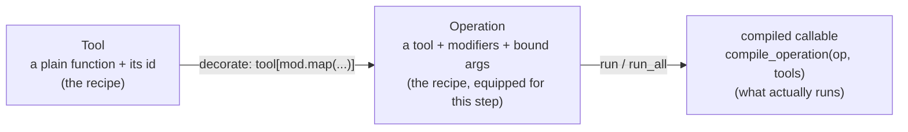
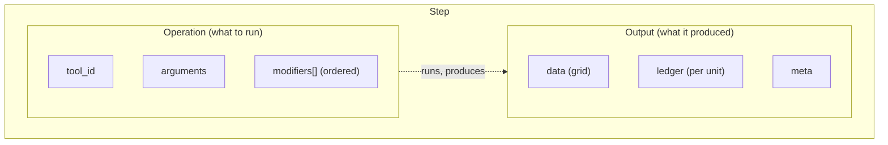
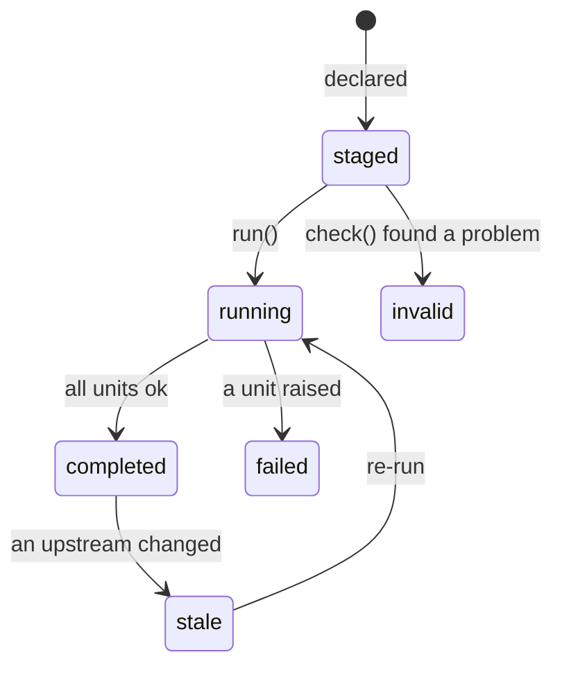
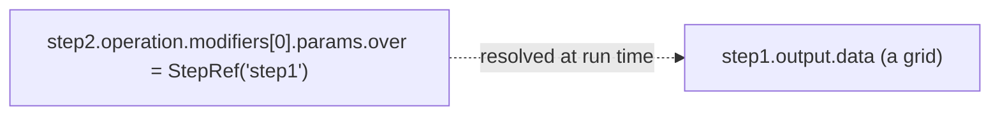

# Object model — the grid model (top-down)

> **Status: describes `grid.py` as it is today.** This is the canonical
> vocabulary, read from the top (a whole workflow) down to the smallest unit (a
> cell). The companion documents and their tenses:
>
> | document | tense | authority on |
> |---|---|---|
> | **object-model.md** (this) | **present** | the objects the code holds and how they nest |
> | [grid-model.md](grid-model.md) | present | how those objects are arranged in `grid.py` |
> | [shape-algebra.md](shape-algebra.md) | intent | *why* the model is shaped this way |
> | [status.md](status.md) | present | what is built and what is open |

Every object a user holds has a dense `__repr__` (safe for logs, no payloads);
a `Step` also has `describe()` (what it is, in words) and an `Output` has
`view()` (the grid joined with its ledger). Nothing dumps payloads in a repr.

---

## The hierarchy at a glance

```
Tool registry (module-level)       the palette of callable tools
├─ TOOLS                           tools you declared with @tool
└─ BUILTIN_TOOLS                   identity · gather · count · total · first · last
    each introspected into a catalog() entry — its public contract

Workflow                           ordered Steps, run against one in-process store
└─ Step*                           one node of the graph: Operation + Output
    ├─ Operation                   WHAT to run (pure data)
    │   ├─ tool_id                 which tool, by id
    │   ├─ arguments               bound literals
    │   └─ modifiers[]             an ORDERED stack, innermost-first
    │       ├─ shape verb          at most one: map | filter | expand | collapse
    │       │                      | group | sweep | source | select | drop
    │       │                      | rename | widen | slice | sort | distinct
    │       └─ execution mods      retry | timeout   (shape-preserving)
    └─ Output                      WHAT it produced
        ├─ data                    the payload grid (a DataFrame)
        ├─ ledger                  per-unit execution state (a DataFrame)
        └─ meta                    verb, payload column, counts, staged flag
```

`*` = repeatable. A `StepRef` (a reference to a step, by id) is what one step
passes to another through a modifier's `over=`.

> **Not in the grid core yet.** `App`, `Session`, `Server`, resources, and media
> — the application layer the legacy engine had — are not built on the grid
> model. A `Workflow` is in-process, and payloads live inline on each `Step`
> (there is no payload store / `Output.ref` yet). See
> [migration-plan.md](migration-plan.md) and [status.md](status.md).

---

## Tool → Operation → compiled call

The three easy-to-confuse things:


```mermaid
flowchart LR
    Tool["Tool<br/>a plain function + its id<br/>(the recipe)"]
    Operation["Operation<br/>a tool + modifiers + bound args<br/>(the recipe, equipped for this step)"]
    Compiled["compiled callable<br/>compile_operation(op, tools)<br/>(what actually runs)"]
    Tool -->|"decorate: tool[mod.map(...)]"| Operation
    Operation -->|"run / run_all"| Compiled
```

> You *author* Operations (pure data); the engine *compiles and runs* them. A
> Tool is the reusable function both refer to. Unlike the legacy engine there is
> no separate `ToolCall` object — an Operation **is** the durable record, and
> `Operation.to_dict()` is its JSON form.

---

## 1. Tool — a registered capability

A tool is a plain Python function that declares the **values** it needs by name.
`@tool` returns a **`ToolHandle`** (the function plus an id) and registers it in
the module-level `TOOLS`; it stays callable as an ordinary function.

```python
@tool
def scale(n, weight=1):        # declares the columns it wants
    return n * 10 * weight

scale(3)            # 30 — still an ordinary function
scale.fn            # the raw function
scale[mod.map()]    # an Operation (brackets decorate)
scale(wf["raw"])    # an Operation (a reference wires + infers a verb)
```

`BUILTIN_TOOLS` — `identity`, `gather`, `count`, `total`, `first`, `last` — need
no registration; they are the pass-throughs and reducers the verbs apply when no
tool is named. A tool's **contract** is its `catalog()` entry:

| field | is |
|---|---|
| `tool_id` · `description` · `origin` | id, first docstring line, `"declared"` / `"builtin"` |
| `params` | `[{name, required, default, type}]` |
| `returns` · `typed` · `takes_whole_row` | return type, whether fully annotated, whether it takes `**row` |

---

## 2. Modifier — one entry in the stack

A **`Modifier`** is a descriptor: a `kind` and its `params` — **data, never a
closure**, which is what lets a step serialize and stage before it runs. Its
class comes from the **`ModifierKind`** vocabulary (`MODIFIERS`), the one place a
kind is declared:

| field | is |
|---|---|
| `kind` | `"map"`, `"widen"`, `"retry"`, … |
| `params` | the verb's own arguments (`over`, `name`, `columns`, `by`, `times`, …) |
| `cls` (via `ModifierKind`) | `"shape"` (changes rows/columns) or `"execution"` (shape-preserving) |

Build one with `mod.<kind>(...)`; it does nothing until applied to a tool.

---

## 3. Operation — one tool, an ordered stack of modifiers

An **`Operation`** is **data**: a `tool_id`, bound `arguments`, and an ordered
tuple of `modifiers`. **Order is semantics** — the stack is stored
innermost-first (closest to the tool runs first), so `[retry, map]` retries each
item and `[map, retry]` retries the whole fan-out.

| member | is |
|---|---|
| `tool_id` · `arguments` · `modifiers` | which tool, bound literals, the stack |
| `.bind(**literals)` | fix arguments without running |
| `op[mod.…]` | append modifiers (decorate) — returns a new Operation |
| `.shape_verb` / `.shape_verbs` | the (at most one) shape verb in the stack |
| `.layers` | the stack as written (outermost-first), the reverse of `modifiers` |
| `.to_dict()` / `from_dict()` | `{tool_id, arguments, modifiers:[{kind, params}]}` |
| `op(data)` / `op(ref)` | **run** on data, or **wire** when given a `StepRef` |

At most **one shape verb** per Operation (enforced): two shape changes in one
step would make an intermediate grid with no cell address.

---

## 4. Output — one grid, two frames

An **`Output`** is what a Step produced: a payload grid beside a row-aligned
ledger that share an index, so `view()` is a clean join.

| member | is |
|---|---|
| `data` | the payload `DataFrame` — what downstream steps consume (immutable) |
| `ledger` | per-unit state — `status, error, attempts, seconds, unit` (`LEDGER_COLUMNS`) |
| `meta` | `verb`, `payload` column, `n_in`, `staged`, shape info |
| `view()` | `data` joined with `ledger` — the one table to render |
| `values` | the payload column as a list · `item()` the single payload of a 1-row grid |
| `ok` / `failed` | completed rows · the failed re-drive set, with errors |
| `shape` / `form` / `progress()` | `(rows, cols)` · `scalar`/`column`/`grid` · `"3/4"` |

The split is deliberate: real tables already have `value`/`status` columns
(collisions), the ledger changes while a step runs (mutability) while the payload
must not, and a scalar-only ledger always renders natively (Arrow).

> Today `data` is held **inline** on the Step. `Output.ref` (a key into a payload
> store) is designed but not built — [status.md](status.md) D5.

---

## 5. Step — Operation + Output

A **`Step`** is one node of a workflow and always holds **both** halves: the
`Operation` (what to run) and an `Output` (the slot), present from declaration
and *replaced* — never mutated — when the step runs.


```mermaid
flowchart LR
    subgraph Step
      direction LR
      subgraph Operation["Operation (what to run)"]
        T["tool_id"]
        A["arguments"]
        M["modifiers[] (ordered)"]
      end
      subgraph Output["Output (what it produced)"]
        D["data (grid)"]
        L["ledger (per unit)"]
        E["meta"]
      end
    end
    Operation -. "runs, produces" .-> Output
```

`Step.status` is a **rollup of the ledger**, not a stored field — a step where 3
of 100 rows failed is neither simply "completed" nor "failed":


```mermaid
stateDiagram-v2
    [*] --> staged : declared
    staged --> running : run()
    running --> completed : all units ok
    running --> failed : a unit raised
    staged --> invalid : check() found a problem
    completed --> stale : an upstream changed
    stale --> running : re-run
```

`describe()` says what a step is in words — a **staged** step reports what
staging can *promise* (`"map scale · 4 cells"`, or "at most n", or "unknown"
for `expand`), while a run step reports what it actually holds.

> **Staleness is marked, never recomputed.** Reassigning an upstream step marks
> its completed dependents **`stale`** — their data is kept, their `status`
> reads `stale` — until you re-run them. Nothing recomputes on its own
> ([status.md](status.md) §5).

---

## 6. Workflow — ordered steps

A **`Workflow`** is an insertion-ordered dict of Steps and nothing else.

| operation | does |
|---|---|
| `wf[sid] = <Operation \| value>` | declare a step (a bare value is a source step, born completed) |
| `wf[sid]` / `wf[0]` | a `StepRef` by **name** or **position** (a position resolves to the id at once) |
| `wf.step(sid)` | the `Step` itself |
| `del wf[sid]` / `wf.remove(sid)` | delete a step — refused (naming the readers) if a later step reads it |
| `wf.rename(old, new)` | rename a step, rewriting every `over=` that pointed at it; outputs kept |
| `wf.run(sid)` / `wf.run_all()` | execute — explicit; nothing recomputes on its own |
| `wf.validate()` | `{sid: problems}` for every step, without running |
| `wf.to_json()` / `to_session_json()` | light (structure) / full (structure + payloads) export |
| `Workflow.from_json(data, tools)` | rebuild either, re-attaching functions |

A **`StepRef`** (id + the workflow it belongs to) is how one step names another;
it serializes to the plain id and is what a modifier's `over=` holds. Staleness
and fingerprints are not built — nothing recomputes automatically ([status.md](status.md) §5).

---

## 7. References & the payload


```mermaid
flowchart LR
    s1["step1.output.data (a grid)"]
    s2["step2.operation.modifiers[0].params.over = StepRef('step1')"]
    s2 -. "resolved at run time" .-> s1
```

A later step reads an earlier one through `over=wf["step1"]`. Accessor paths
resolve on a reference — `step1.ok`, `step1.failed`, `step1[0]`, `step1["col"]`.
Because payloads are inline today, two steps reading one grid each hold a copy;
moving them behind `Output.ref` into a store is the next structural step
([migration-plan.md](migration-plan.md)).
