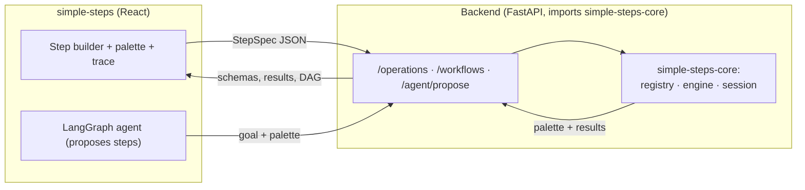
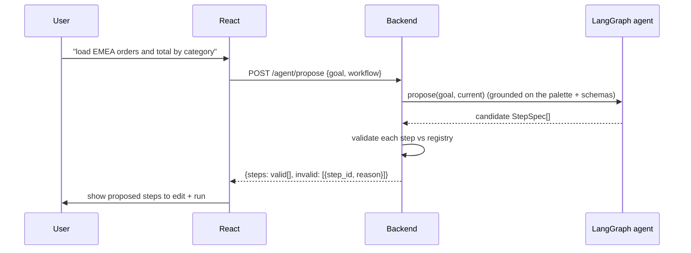

# Integrating simple-steps-core into the `simple-steps` app

This guide shows how to use `simple-steps-core` as the backend for the
`simple-steps` application — a React frontend plus an optional **LangGraph
agent** that helps users create and manage workflow steps.

A complete, runnable reference backend lives in
[examples/simple_steps_backend](../examples/simple_steps_backend); this guide
explains the contract so you can adapt it.

---

## 1. Architecture



- **simple-steps-core** owns the tools, execution, and session data.
- The **backend** is a thin FastAPI layer that translates HTTP ⇄ core calls and
  persists workflows.
- The **frontend** renders tool forms from JSON Schema, builds `StepSpec`s, runs
  them, and traces results.
- The **agent** turns a natural-language goal into a validated `StepSpec[]` the
  user reviews and runs — it never executes anything itself.

Division of responsibility:

| Concern | Owned by |
| --- | --- |
| Tool definitions, execution, references, sessions | simple-steps-core |
| HTTP transport, auth, workflow persistence, agent wiring | backend (this repo) |
| Forms, graph, tracing, human-in-the-loop UX | React frontend |

---

## 2. Install

In the `simple-steps` backend project:

```bash
pip install simple-steps-core        # core (pydantic only)
pip install "simple-steps-core[api]" # + FastAPI/uvicorn for the HTTP layer
```

Register operations **once at startup**, add the built-in orchestrators, and
freeze the registry (read-only ⇒ safe concurrent reads):

```python
from simple_steps_core import OperationRegistry, CoreEngine, register_orchestrators

registry = OperationRegistry()
# @register_operation on REGISTRY, or registry.register(...) — your tools here
register_orchestrators(registry)     # map / filter / expand / collapse
registry.freeze()
engine = CoreEngine(registry)
```

---

## 3. The data contract

Three shapes cross the boundary. TypeScript definitions are in
[types.ts](../examples/simple_steps_backend/types.ts).

### 3.1 OperationDefinition (the palette)

What `GET /operations` returns per tool — drives UI forms and agent grounding:

```json
{
  "operation_id": "load",
  "description": "Load rows for a region.",
  "category": "io",
  "type": "source",
  "params": [
    {"name": "region", "type_name": "str", "required": true,  "default": null, "kind": "data"},
    {"name": "limit",  "type_name": "int", "required": false, "default": 100,  "kind": "data"}
  ],
  "input_schema": {
    "type": "object",
    "properties": {"region": {"type": "string"}, "limit": {"type": "integer", "default": 100}},
    "required": ["region"],
    "additionalProperties": false
  },
  "output_schema": {"type": "object", "properties": {"result": {"type": "array"}}},
  "dependencies": []
}
```

- `input_schema` is standard JSON Schema — render form fields directly from it.
- `params[].kind` is `"data"` (user/agent supplies) or `"resource"` (injected;
  never shown to the user). `dependencies` lists the resource names.

### 3.2 StepSpec (a step)

What the UI/agent produces per step. Orchestration is declared **inline**:

```json
{
  "step_id": "step_totals",
  "name": "order_total",
  "arguments": { "currency": "USD" },
  "orchestration": {
    "mode": "map", "over": "step_orders", "concurrency": 8,
    "on_error": "collect", "retries": 2, "item_arg": null, "initial": null
  },
  "execution": { "mode": "sync", "run": "manual", "timeout": null, "retries": 0, "cache": false }
}
```

- `arguments` values are literals **or** string references to an earlier step
  (`"step_orders"`, `"step_orders.rows"`). References must start with `step`.
- `orchestration.mode`: `single` runs the tool once; `map`/`filter`/`expand`/
  `collapse` apply it across the collection referenced by `over`.
- `execution.run` is `manual` by default — the user triggers each run.

### 3.3 WorkflowOut (results/trace)

What run/get endpoints return:

```json
{
  "workflow_id": "wf-001",
  "status": "completed",
  "steps": [
    {"step_id": "step_orders", "name": "load_orders", "mode": "single",
     "status": "completed", "value": [...], "error": null}
  ]
}
```

---

## 4. Backend API surface

Implemented in [app.py](../examples/simple_steps_backend/app.py):

| Method & path | Purpose |
| --- | --- |
| `GET /operations` | Tool palette (`OperationDefinition[]`). |
| `POST /workflows` | Create from `{workflow_id, steps: StepSpec[]}` (validates each step). |
| `GET /workflows/{id}` | Status + per-step results. |
| `POST /workflows/{id}/run` | Run all steps (async), persist, return trace. |
| `POST /workflows/{id}/steps/{sid}/run` | Run a single step. |
| `GET /workflows/{id}/dag` | `{nodes, edges}` from references + `orchestration.over`. |
| `POST /agent/propose` | Agent proposes/edits a validated `StepSpec[]`. |

Persistence: each workflow is stored as **one session snapshot**
(`Workflow.export_session_json()`), which captures step structure *and* computed
payloads. On run, the backend imports the snapshot, runs, and re-saves it. Swap
the in-memory [store.py](../examples/simple_steps_backend/store.py) for a DB
table keyed by `workflow_id`.

Per-user isolation uses `SessionManager` (a per-session `asyncio.Lock`); build a
`session_id` with `make_session_id(user, workflow, run)`.

---

## 5. The agent (LangGraph)

The agent's contract is deliberately narrow: **goal + current steps → validated
`StepSpec[]`**. It proposes; the user disposes.



Key points:

- The agent is grounded on the **palette** (`OperationDefinition` +
  `input_schema`) — it can only pick real tools and real arguments.
- Every proposed step is **validated server-side** (`validate_step`) before it
  reaches the UI; invalid steps are flagged, not executed.
- Execution stays with the user: proposals default to `execution.run = "manual"`.

Wiring a real planner — the backend depends only on a `Planner` protocol
([agent.py](../examples/simple_steps_backend/agent.py)):

```python
from examples.simple_steps_backend.agent import build_langgraph_planner
planner = build_langgraph_planner(registry, model="openai:gpt-4o-mini")
app = create_app(registry, engine, planner=planner)
```

`build_langgraph_planner` uses structured output (the LLM must return objects
matching `StepSpec`) grounded on the palette. To add memory or multi-turn
planning, wrap `planner.propose` as a node in a LangGraph `StateGraph` whose
state carries the goal, the palette, and the working `StepSpec[]`. Map the
graph's `thread_id` to your `workflow_id`; keep large tool outputs in the core
`SessionContext` (the agent reasons over step ids + schemas, not payloads).

---

## 6. Frontend integration notes

- **Palette → forms.** Fetch `GET /operations`; render each tool's
  `input_schema` with a JSON-Schema form library. Show only `kind === "data"`
  params. `dependencies` (resources) are backend-provided — never rendered.
- **Arguments: literal vs reference.** For each data field, let the user type a
  value *or* pick "use output of step N" (which sets the value to that step id
  string, e.g. `"step_orders"`). Offer a field picker (`step_orders.rows`).
- **Orchestration UI.** A per-step control sets `orchestration.mode` and, for
  non-`single`, an `over` step picker plus `concurrency`/`on_error`.
- **Trace.** After `run`, render each `StepView` (`status`, `value`, `error`).
  Use `GET /workflows/{id}/dag` for a node/edge graph.
- **Agent panel.** Send the goal (and current steps) to `/agent/propose`; show
  returned `steps` as an editable draft and surface `invalid[]` inline.

The typed client in [types.ts](../examples/simple_steps_backend/types.ts):

```ts
import { SimpleStepsClient } from "./types";
const api = new SimpleStepsClient(import.meta.env.VITE_API_URL);

const ops = await api.operations();
const plan = await api.propose({ goal });
await api.createWorkflow({ workflow_id, steps: plan.steps });
const result = await api.runWorkflow(workflow_id);
```

---

## 7. Runtime resources (db/clients)

If your tools declare `Resource()` parameters (a DB connection, an API client),
register them per session on the backend — they're injected at run time and
never exposed to the UI or agent:

```python
wf = Workflow(engine, session_id=workflow_id)
wf.context.resources.register("db", lambda: connect_db())
```

The reference `create_app` accepts a `resources` mapping applied to every
request session; see the `RESOURCES` hook in the CLI (`serving.py`) for the same
pattern.

---

## 8. Security & ops checklist

- **Freeze the registry** after startup; only registered operations run — no
  arbitrary code from the frontend or agent.
- **Validate at the boundary** (`validate_step`) before persisting or running.
- **Isolate sessions** per user/run with `SessionManager` + `make_session_id`.
- **Snapshots exclude un-encodable payloads** unless you register a codec; they
  never contain resources. No pickle (RCE-safe by design).
- **Agent output is untrusted** — always validate; keep `run = "manual"` so a
  human approves execution.
- Put authentication, rate limiting, and CORS at the FastAPI layer (the core is
  transport-agnostic).

---

## 9. What the core does not provide (build in `simple-steps`)

- Auth, multi-tenant storage, and the React UI.
- The LLM itself and any conversation memory (wrap the `Planner` in LangGraph).
- Cross-session long-term memory (saved workflows across users) — persist your
  own `StepSpec[]` / snapshots keyed by user.
